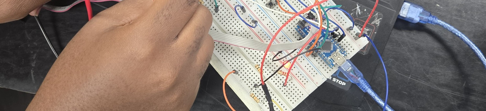

# 🌟 Welcome to My GitHub! 🚀

---

## 👋 Hey There, I'm Rinaldo!

I'm a **passionate developer** 💻, **problem solver** 🧠, and **tech enthusiast** 🌍 who loves building cool stuff and learning new things.

- 🌍 **Based in Kingston, Jamaica.**
- 🌱 **Currently learning Mobile Development**
- 🤝 **Open to collaborate on projects**
- 📫 **Reach me at Rinaldohalliburton7917@gmail.com**

---

| Languages 🧑🏾‍💻                                                                                                     | Frameworks & Tools ⚙️                                                                                                | Other stuff🔍                                                                                           |
| ---------------------------------------------------------------------------------------------------------------- | -------------------------------------------------------------------------------------------------------------------- | ------------------------------------------------------------------------------------------------------- |
|  |                     |              |
|  |               |     |
|                       |               |        |
|                 |  |        |
|                    |      |  |

## 🚀 Projects

#### Check out my repos

---

## 🌐 Connect with Me

Let's code together! 😎 Find me on:

  

---

> _"Code is like art: it’s never finished, only abandoned… until the next commit!"_ 💾

---
